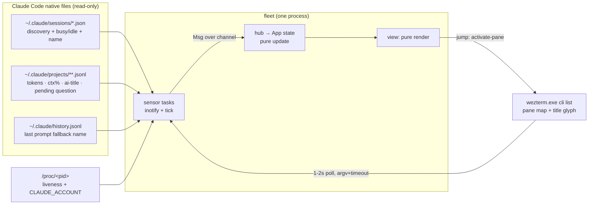
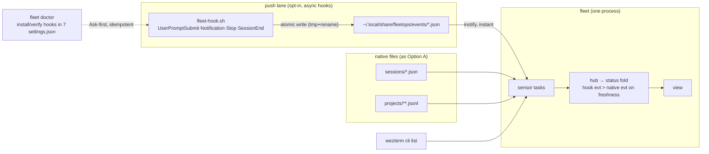
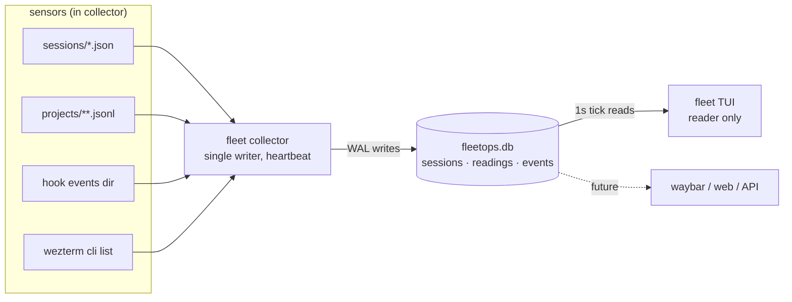
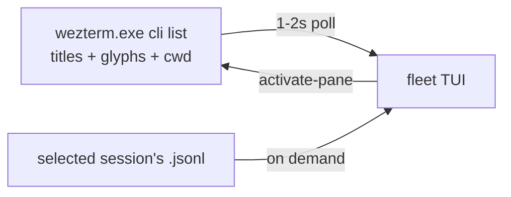

# Options — candidate architectures

> Four genuinely different shapes. Shared decree for all: Rust 2021 strict, ratatui MVU seams
> (`tui/{model,view,keys,mod}.rs`), tokio, `runner.rs` argv+timeout subprocess seam, `paths.rs`
> XDG resolution — all ported from tokenomics. The options differ in **data plane, store, and
> process topology**. Status vocabulary (domain): `Working / NeedsDecision (permission) /
> NeedsAnswer (question) / Done / Idle / Gone`, each carrying provenance + freshness (tokenomics
> staleness lesson: never show stale as live).

## Option A — "Sensor fusion, single process" (native files reader)

**Essence:** One `fleet` binary, read-only, zero installation. Fuses four native sources Claude Code
already writes: `~/.claude/sessions/<pid>.json` (discovery + busy/idle + name), live-session JSONL
tails (tokens, context %, ai-title, pending AskUserQuestion), `/proc` (liveness + account attribution),
`wezterm cli list` (pane map + glyph). In-memory state only; no daemon, no store, no hooks.

- **DDD boundaries:** `discovery` (Session aggregate: identity = sessionId, owns liveness invariant PID+procStart), `telemetry` (UsageReading: ctx%, tokens, provenance), `status` (state machine folding sensor events; owns freshness invariant), `panes` (PaneMap), `tui`. Each sensor is a `bridge`-style source task → normalized `FleetEvent` → hub.
- **Test seams:** every parser pure (`sessions/*.json`, JSONL lines, wezterm JSON, environ) with fixture files; status fold pure + table-tested; CannedRunner for wezterm; TestBackend snapshots. Loop speed = tokenomics-grade (all-pure, no spawn).
- **Ceiling (accepted):** permission-wait invisible (not in JSONL); questions detected only via pending-tool_use; transitions lag by debounce/poll (~1–2 s); everything rides undocumented internals (A1/A2).
- **Evolution path:** add Option B's hook lane as one more sensor (additive — hub already normalizes events); add SQLite history if sparklines wanted. Exit cost ≈ zero (sensors are plug-in tasks).
- **Rough cost:** ~3–4 waves to full board. Run cost: one process, ~0 attention.

## Option B — "A + async hook push" (event-driven hybrid) 

**Essence:** Everything in A, plus an **opt-in push lane**: `async: true` command hooks (one shared
`fleet-hook.sh`, installed/verified by `fleet doctor` across the 7 settings.json — Ask-first honored)
atomically write `~/.local/share/fleetops/events/<session_id>.json` on UserPromptSubmit(working +
session_title), Notification(permission_prompt → NeedsDecision, idle_prompt → idle-confirm),
Stop(done + last message), SessionEnd(gone). Hooks close exactly the two gaps A cannot see
(instant transitions, permission prompts); JSONL still supplies tokens/context/questions.
Still one TUI process; the events dir is not a store, it's a mailbox.

- **DDD boundaries:** A's contexts + `pushlane` (HookEvent value objects; `doctor` owns the installed-and-identical invariant). Status fold merges by (source-priority, freshness) — the tokenomics overlay-merge pattern reused.
- **Test seams:** all of A's + hook script tested by executing it against fixture stdin (bash, 2 ms); fold merge table-tested; doctor diff pure.
- **Degraded mode = Option A exactly** (hooks absent/broken → same board, coarser status). This is the key safety property: the push lane is additive, never load-bearing.
- **Evolution path:** same as A → SQLite history; `WSLENV=WEZTERM_PANE` forwarding for exact pane match; hook lane extends to SubagentStart/Stop for per-agent rows. Exit: delete hooks via doctor, still have A.
- **Rough cost:** A + ~1 wave (script + doctor + merge). Run cost: one process + 2 ms/hook-event; attention: doctor re-verify after CC updates.

## Option C — "Tokenomics twin" (collector daemon + SQLite WAL + TUI reader)

**Essence:** Full sibling symmetry: `fleet collector` daemon owns all sensors (A's readers + B's
mailbox ingest), normalizes into SQLite (WAL, user_version migrations, heartbeat, retention prune);
`fleet` TUI reads the store on a 1 s tick. Buys **history** (per-session burn sparklines, session
timeline, "what did I run today"), multi-client readers (waybar/web later), TUI-restart amnesia-free.

- **DDD boundaries:** as B, plus `store` (schema owns retention + provenance columns; collector = sole writer discipline verbatim from tokenomics `collector.rs:20-26`).
- **Test seams:** tokenomics-identical (tempfile SQLite, FakeAdapter sensors, bounded-time collector tests) — the most proven test story of the four.
- **Costs:** two processes to install/run/upgrade (the documented **stale-binary footgun** now applies to a daemon); migrations forever; SQLite adds no freshness (no cross-process change notification — TUI polls anyway); **evidence against**: Claude Code itself + the entire monitor ecosystem use flat files, zero SQLite in `~/.claude`.
- **Evolution path:** already at the end-state shape; adding clients is trivial. Exit cost: high (store schema is the public contract).
- **Rough cost:** A + ~2–3 extra waves (store, daemon lifecycle, doctor for two binaries). Attention: heartbeat/daemon babysitting — the six tokenomics staleness bugs were all *this* class.

## Option D — "wezterm lens" (do-less / defer)

**Essence:** Poll `wezterm cli list` alone (~1–2 s): pane title glyph (⠂/✳) = status, title text =
name, pane cwd = project; transcripts read only for the *selected* session's detail pane. ~1 day build.

- **DDD boundaries:** one context (`panes`); no Session aggregate — the pane IS the row.
- **Test seams:** wezterm JSON parser + glyph classifier pure; thin.
- **Ceiling:** no tokens/context in overview; Working/Idle only (no NeedsDecision/NeedsAnswer); glyph format undocumented (A2) with **no fallback** — when it changes, the board is blind; sessions outside wezterm invisible.
- **Evolution path:** grows into A by adding sensors — nothing thrown away except its simplicity.
- **Rough cost:** ~1 wave. The honest baseline every other option must beat.
